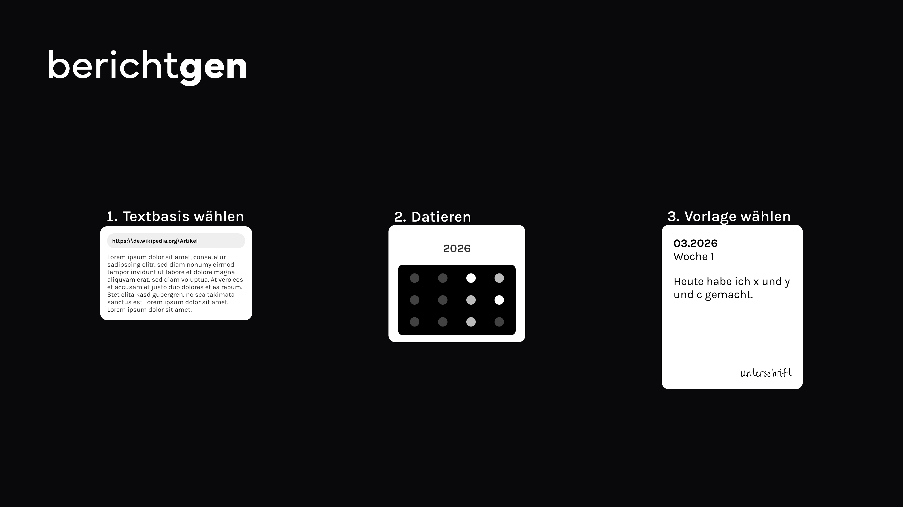

Berichtgen ist eine Webanwendung, mit der Auszubildende ihre Ausbildungsnachweise automatisch aus Dateien und Vorlagen erstellen können. Die App verarbeitet Uploads, verteilt Inhalte auf Berichtszeiträume und generiert daraus mit KI fertige Berichte.

### Setup-Checkliste

### Supabase

#### Projekt

- [ ] Alle Migrationen anwenden.
- [ ] Supabase `site_url` auf die exakte öffentliche Origin der App pro Umgebung setzen.
  - Lokal: `http://localhost:5173`
  - Produktion: `https://www.berichtgen.de`
- [ ] Alle Auth-Callback- und Redirect-URLs hinterlegen.
- [ ] Supabase `SSL Enforcement` aktivieren.
- [ ] Diese Variablen in Vercel setzen:
  - `PUBLIC_SUPABASE_URL`
  - `PUBLIC_SUPABASE_PUBLISHABLE_KEY`
  - `SUPABASE_SECRET`
  - `DATABASE_URL` - direkte Postgres-Connection-String von Supabase für App/Server
  - `SUPABASE_CA` - CA-Zertifikat für die erzwungene SSL-Datenbankverbindung

#### E-Mail-Login

- [ ] E-Mail- / OTP-Auth in Supabase aktivieren.
- [ ] SMTP-Server konfigurieren.
- [ ] Prüfen, dass Auth-E-Mails korrekt versendet werden.

#### Google OAuth

- [ ] Google-Auth in Supabase aktivieren.
- [ ] Richtige Google Client-ID und Secret hinterlegen.
- [ ] Prüfen, dass die in Supabase konfigurierte Callback-URL mit der Google Cloud Console übereinstimmt.
- [ ] Diese Variablen dort setzen, wo die lokale Supabase-Konfiguration sie einliest:
  - `AUTH_GOOGLE_ID`
  - `AUTH_GOOGLE_SECRET`

### Google Cloud

#### Vertex AI

- [ ] Vertex-AI-API aktivieren.

#### Wizard-Upload-Bucket

- [ ] Cloud-Storage-API aktivieren.
- [ ] Bucket für Wizard-Datei-Uploads anlegen.
- [ ] In Vercel setzen:
  - `GCS_BUCKET_NAME` - Bucket für temporäre Wizard-Dateien vor der KI-Verarbeitung

#### Backup-Bucket

- [ ] Separaten GCS-Bucket für tägliche Datenbank-Backups anlegen.
- [ ] Als GitHub-Secret hinterlegen:
  - `GCS_BACKUP_BUCKET_NAME`

#### Service Account

- [ ] Service Account für Vertex AI und GCS anlegen.
- [ ] Berechtigungen vergeben für:
  - [ ] Vertex AI
  - [ ] Wizard-Upload-Bucket
  - [ ] Backup-Bucket, falls derselbe Account dafür genutzt wird
- [ ] JSON-Key exportieren.
- [ ] In Vercel setzen:
  - `GCS_SERVICE_ACCOUNT_KEY` - JSON-Credentials für GCS-Signed-Uploads und Vertex AI

### Google OAuth Console

- [ ] Alle autorisierten Redirect-URIs eintragen.
- [ ] Falls nötig, alle autorisierten JavaScript-Origins eintragen.
- [ ] OAuth-Branding konfigurieren.
- [ ] Datenschutz- und Nutzungsbedingungen-URLs in der Google Cloud Console korrekt setzen.

### Vercel

- [ ] Prüfen, dass Produktion `SUPABASE_CA` gesetzt hat; die App braucht es bei aktiviertem Supabase-`SSL Enforcement`.

#### Schutzmaßnahmen

- [ ] Firewall- / Bot-Schutz konfigurieren.
- [ ] Rate Limits hinzufügen für:
  - [ ] Auth-Endpunkte
  - [ ] teure Remote-Funktionen / KI-Routen
  - [ ] Stripe-Webhook, falls nötig

### Stripe

- [ ] Stripe-API-Keys für die Umgebung anlegen.
- [ ] Stripe-Webhook-Endpunkt anlegen.
- [ ] Diese Stripe-Webhook-Events konfigurieren:
  - `charge.refunded`
  - `payment_intent.canceled`
  - `payment_intent.succeeded`
- [ ] Diese Variablen in Vercel setzen:
  - `PUBLIC_STRIPE_KEY`
  - `STRIPE_SECRET_KEY`
  - `STRIPE_WEBHOOK_SECRET`

### Sentry

- [ ] In Vercel setzen:
  - `SENTRY_AUTH_TOKEN` - wird vom Vite/Sentry-Build-Setup verwendet

### GitHub Actions

#### Repository-Secrets

- [ ] Diese Secrets anlegen:
  - `DATABASE_URL` - Supabase Session-Mode-Pooler-Connection-String für den Backup-Workflow
  - `GCS_BACKUP_BUCKET_NAME` - Bucket für komprimierte DB-Dumps
  - `GCS_BACKUP_ACCOUNT_KEY` - Google-Service-Account-JSON für den Backup-Workflow

#### Backup-Workflow

- [ ] Sicherstellen, dass `.github/workflows/daily-db-backup.yml` auf dem Default-Branch liegt.
- [ ] Den Workflow einmal per `workflow_dispatch` ausführen.
- [ ] Prüfen, dass der Dump im GCS-Backup-Bucket erscheint.
- [ ] Prüfen, dass `pg_dump` in Version 17 verwendet wird.

### Entwicklungs-Umgebungsvariablen

- `AUTH_GOOGLE_ID`
- `AUTH_GOOGLE_SECRET`
- `GCS_BUCKET_NAME` - temporärer Wizard-Upload-Bucket
- `GCS_SERVICE_ACCOUNT_KEY` - Google-Service-Account-JSON für Upload-Signing und Vertex AI
- `PUBLIC_SUPABASE_URL`
- `PUBLIC_SUPABASE_PUBLISHABLE_KEY`
- `SUPABASE_SECRET`
- `DATABASE_URL` - direkte Supabase-Postgres-Connection-String
- `SUPABASE_CA` - DB-CA-Zertifikat für die SSL-erzwungene Supabase-Verbindung
- `SENTRY_AUTH_TOKEN` - Sentry-Auth für den Build
- `PUBLIC_STRIPE_KEY`
- `STRIPE_SECRET_KEY`
- `STRIPE_WEBHOOK_SECRET`
- `SMTP_HOST`
- `SMTP_USER`
- `SMTP_PASS`
- `SMTP_SENDER_NAME`
- `SMTP_ADMIN_EMAIL`

### Kostenübersicht (GCP + Vercel)

Eine PDF-Datei mit einer textvollen Seite ist ungefähr 30 KB groß. Mit Googles Modellen entspricht das ungefähr 560 LLM-Input-Tokens.
Eine TXT-Datei mit derselben Textmenge ist ungefähr 5 KB groß und liegt bei rund 1000 LLM-Input-Tokens; die tatsächliche Zahl wird dynamisch berechnet.

### Vertex AI / Gemini API

`gemini-3.1-flash-lite-preview` kostet `0,25 USD` pro `1 Mio.` Input-Tokens und `1,50 USD` pro `1 Mio.` Output-Tokens.
`1 Mio.` Input-Tokens entsprechen damit ungefähr `1786` PDF-Input-Dateien oder ungefähr `1000` TXT-Dateien.

### Google Cloud Storage

#### [EUW, Regional, Standard-Klasse](https://cloud.google.com/storage/pricing?hl=en)

| Speicher | Datenverarbeitungsoperationen |
| - | - |
| `0,000031507 USD / 1 Gibibyte-Stunde` | Klasse A: `0,005 USD / 1.000 Ops` Klasse B: `0,0004 USD / 1.000 Ops` |

Ein Upload plus Delete (Delete ist kostenlos) kostet:
`0,005 USD / 1.000 = 0,000005 USD`

Für einen recht großen Wikipedia-Artikel als PDF (`2,5 MB`) kostet die Speicherung für `24 h`:
`0,000031507 USD/h * 0,0025 GB * 24 h = 0,00000189042 USD/Tag`

Break-even, also ab wann Speichern günstiger ist als erneutes Hochladen:
`0,00000189042 USD / 0,000005 USD ≈ 0,378 Uploads`

#### [EUW, Zoned, Rapid-Klasse](https://cloud.google.com/storage/pricing?hl=en)

| Speicher | Datenverarbeitungsoperationen |
| - | - |
| `0,000150685 USD / 1 Gibibyte-Stunde` | Klasse A: `0,00113 USD / 1.000 Ops` Klasse B: `0,0002 USD / 1.000 Ops` |

Ein Upload plus Delete (Delete ist kostenlos) kostet:
`0,00113 USD / 1.000 = 0,00000113 USD`

Derselbe Artikel (`2,5 MB`) kostet:
`0,000150685 USD/h * 0,0025 GB * 24 h = 0,0000090411 USD/Tag`

Break-even, also ab wann Speichern günstiger ist als erneutes Hochladen:
`0,0000090411 USD / 0,00000113 USD ≈ 8 Uploads`

### Vercel (AWS)

| Metrik | Kostenlos enthalten | Startpreis |
| - | -: | -: |
| Aktive CPU | `4 Stunden / Monat` | `0,128 USD pro Stunde` |
| Bereitgestellter Speicher | `360 GB-Stunden / Monat` | `0,0106 USD pro GB-Stunde` |
| Invocations | `1 Mio. / Monat` | `0,60 USD pro 1 Mio.` |

### Datenschutz

`https://www.berichtgen.de/datenschutz`
